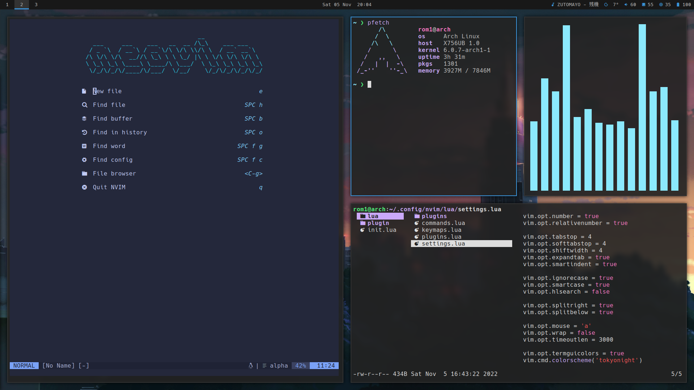

[r/unixporn](https://www.reddit.com/r/unixporn/comments/zswnv3/sway_wayland_is_the_way_to_go/)

I switched to Sway, but my i3 config is still on [this branch](https://github.com/Lysquid/dotfiles/tree/i3).

## Config

+ Distribution : [Arch Linux](https://archlinux.org/)
+ Display server : [Wayland](https://wayland.freedesktop.org/)
+ Window manager : [Sway](https://swaywm.org/)
+ Status bar : [Waybar](https://github.com/Alexays/Waybar)
+ Display manager : [greetd](https://git.sr.ht/~kennylevinsen/greetd)
+ Lock screen : [swaylock](https://github.com/swaywm/swaylock)
+ Font : [JetBrainsMono Nerd Font](https://www.jetbrains.com/lp/mono/)
+ Gtk theme : [Orchis](https://github.com/vinceliuice/Orchis-theme)
+ Icon theme : [Tela](https://github.com/vinceliuice/Tela-icon-theme)
+ Cursor theme : [Vimix cursors](https://github.com/vinceliuice/Vimix-cursors)
+ Terminal : [kitty](https://sw.kovidgoyal.net/kitty/)
+ Shell : [fish](https://fishshell.com/)
+ Prompt : [Starship](https://starship.rs/)
+ Editor : [Neovim](https://neovim.io/)
+ File manager : [lf](https://github.com/gokcehan/lf/)
+ Application launcher : [rofi](https://github.com/davatorium/rofi)
+ Browser : [Firefox](https://www.mozilla.org/firefox/)
+ Mail client : [Thunderbird](https://www.thunderbird.net)
+ Image viewer : [Viewnior](https://github.com/hellosiyan/Viewnior)
+ Media player : [mpv](https://mpv.io/)
+ Document viewer : [Evince](https://wiki.gnome.org/Apps/Evince)
+ Notification daemon : [mako](https://github.com/emersion/mako)
+ Input method : [Fcitx5](https://fcitx-im.org/wiki/Fcitx_5)
+ Clipboard manager : [Clipman](https://github.com/yory8/clipman)
+ Editor colorscheme : [TokyoNight](https://github.com/folke/tokyonight.nvim)
+ Wallpaper : [言の葉の庭](https://www.reddit.com/r/wallpaper/comments/n9kuz5)

## More cool softwares

+ [Virt-Manager](https://virt-manager.org/) : virtual machine manager for QEMU/KVM
+ [Transmission](https://transmissionbt.com/) : BitTorrent client
+ [Lutris](https://lutris.net/) : game launcher
+ [Godot](https://godotengine.org/) : game engine
+ [Pinta](https://www.pinta-project.com/) : image editor
+ [swappy](https://github.com/jtheoof/swappy) : screenshot editor
+ [grim](https://sr.ht/~emersion/grim/) : screenshot tool
+ [wf-recorder](https://github.com/ammen99/wf-recorder) : screen recorder
+ [Calibre](https://calibre-ebook.com/) : ebook reader and manager
+ [Qalculate](https://github.com/Qalculate/qalculate-gtk) : calculator
+ [yay](https://github.com/Jguer/yay) : AUR helper
+ [rsync](https://wiki.archlinux.org/title/rsync) : backups
+ [Rclone](https://github.com/rclone/rclone) : cli tool for cloud sync
+ [Gcolor3](https://www.hjdskes.nl/projects/gcolor3/) : color picker
+ [udiskie](https://github.com/coldfix/udiskie/) : automount disks and USB keys
+ [kanshi](https://sr.ht/~emersion/kanshi/) : automatic switch between display configs
+ [wdisplays](https://github.com/artizirk/wdisplays) : graphical display settings
+ [wshowkeys](https://git.sr.ht/~sircmpwn/wshowkeys) : show keys being typed on screen
+ [youtube-dl](https://github.com/ytdl-org/youtube-dl) : download youtube videos
+ [ani-cli](https://github.com/pystardust/ani-cli) : cli tool to watch anime
+ [Anki](https://apps.ankiweb.net/) : best flashcard app
+ [btop](https://github.com/aristocratos/btop) : ressource monitor
+ [trash-cli](https://github.com/andreafrancia/trash-cli) : trash management
+ [playerctl](https://github.com/altdesktop/playerctl) : controll media players from the command line
+ [dust](https://github.com/bootandy/dust) : see what is taking place on the disk

## Inspirations

+ [Eric Murphy](https://www.youtube.com/c/EricMurphyxyz) ([dotfiles](https://github.com/ericmurphyxyz/dotfiles)) : best minimalist set up
+ [MentalOutlaw](https://www.youtube.com/c/MentalOutlaw) ([dotfiles](https://github.com/MentalOutlaw/deploygentoo)) : another minimalist, security paranoid
+ [Brodie Robertson](https://www.youtube.com/c/BrodieRobertson) ([dotfiles](https://github.com/BrodieRobertson/dotfiles)) : cool software reviews from an epic weeb
+ [Luke Smith](https://www.youtube.com/c/LukeSmithxyz) ([dotfiles](https://github.com/LukeSmithxyz/voidrice)): bomer config
+ [DistroTube](https://www.youtube.com/c/DistroTube) ([dotfiles](https://gitlab.com/dwt1/dotfiles)) : window manager enthutiast with unpopular opinions
+ [ThePrimeagen](https://www.youtube.com/c/ThePrimeagen) ([dotfiles](https://github.com/ThePrimeagen/.dotfiles)) : vim guru
+ [Neovim Starter devlog](https://vonheikemen.github.io/devlog/tools/build-your-first-lua-config-for-neovim/) ([github](https://github.com/VonHeikemen/nvim-starter)) : to get started configuring neovim
+ [A Mouseless Development Environment](https://thevaluable.dev/mouseless-development-environment/) : why I went down the rabbit hole in the first place
+ [Unixporn](https://www.reddit.com/r/unixporn/) : the reason why we keep ricing

## More resources

+ [Arch Wiki](https://wiki.archlinux.org/) : the bible
+ [i3 Migration Guide](https://github.com/swaywm/sway/wiki/i3-Migration-Guide) : good list of basic Wayland apps
+ [How Linux Works](https://nostarch.com/howlinuxworks3) : very complete book on Linux theory
+ [TechHunt](https://www.youtube.com/c/TechHutHD) : more software reviews
+ [DJ Ware](https://www.youtube.com/c/DJWareCG) : deep dives into Linux technologies
+ [DevOnDuty](https://www.youtube.com/channel/UCFU7a7OMYfcpjtIpu2j47_Q) : neovim news
